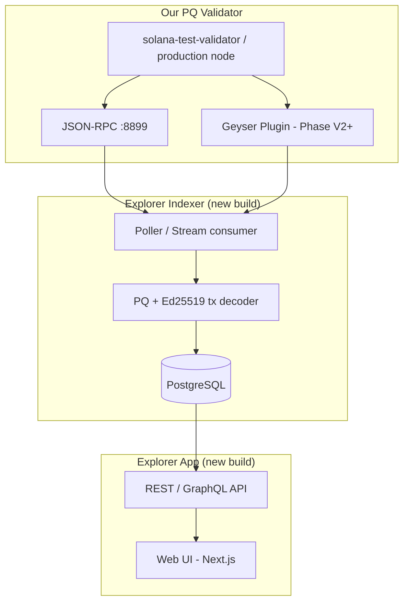
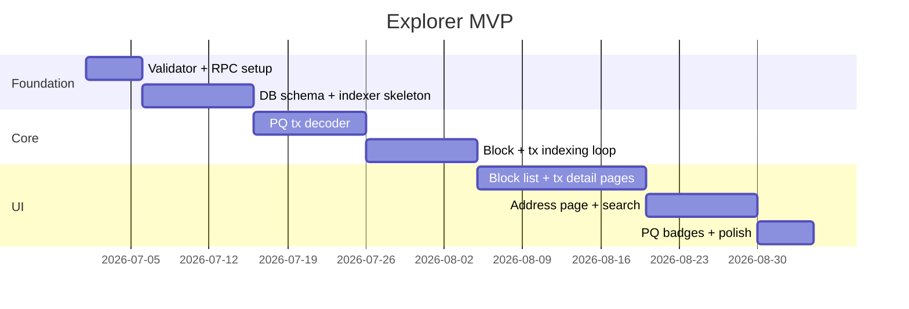

# Block Explorer Roadmap — Solscan-Style for the PQ Network

**Audience:** Management, product, and engineering leads  
**Last updated:** June 2026  
**Depends on:** [`overview.md`](./overview.md) (migration must be running on at
least one validator)

---

## Executive summary

A **block explorer** (like Solscan or Solana Explorer) is the public window into
our chain. Without it, post-quantum transactions are invisible to anyone who is
not a developer with a terminal.

**Recommendation:** Build a **focused MVP explorer** in **8–10 weeks** that
covers blocks, transactions, and accounts — with clear labeling of post-quantum
(PQ) activity. Do **not** fork Solscan; build a thin custom indexer and web UI
tailored to our ML-DSA wire format.

**Estimated investment:**

| Phase   | Deliverable                                           | Duration    | Team                   |
| ------- | ----------------------------------------------------- | ----------- | ---------------------- |
| **MVP** | Read-only explorer: blocks, txs, addresses, PQ badges | 8–10 weeks  | 1 backend + 1 frontend |
| **V2**  | Real-time updates, search, validator/vote views       | +6–8 weeks  | +0.5 backend           |
| **V3**  | Production scale (Geyser streaming, analytics)        | +8–12 weeks | +1 infra               |

**Key dependency:** A running validator with JSON-RPC enabled and transaction
history turned on.

---

## Why we need this

| Stakeholder need           | Without explorer                           | With explorer                                     |
| -------------------------- | ------------------------------------------ | ------------------------------------------------- |
| **Management / investors** | “Does PQ work?” requires engineering demos | Live dashboard showing PQ txs confirming on-chain |
| **Product / users**        | Cannot send or verify payments visually    | Address pages, balance, transaction history       |
| **Engineering**            | Debugging via CLI only                     | Search by signature, slot, or address             |
| **Compliance / audit**     | No persistent audit trail UI               | Immutable on-chain history with timestamps        |

The migration PoC is **technically proven** but **not demonstrable to
non-engineers** until an explorer exists.

---

## What Solscan does (and what we actually need)

Solscan is a **separate product** that:

1. **Indexes** blockchain data from RPC or a streaming plugin
2. **Stores** it in a database (PostgreSQL, ClickHouse, etc.)
3. **Serves** a web API
4. **Renders** a React/Next.js frontend

We need the **same architecture**, not the same codebase. Stock Solscan assumes
**Ed25519 only** and will **not** correctly display our post-quantum
transactions without significant modification.

### What our explorer must do differently

| Feature           | Standard Solana explorer | Our PQ network                                          |
| ----------------- | ------------------------ | ------------------------------------------------------- |
| Transaction size  | ~1 KB max                | Up to ~4 KB                                             |
| Signature display | 64-byte Ed25519          | 2,420-byte ML-DSA **or** 64-byte Ed25519                |
| Signer address    | Same as public key       | Address = hash of 1,312-byte PQ public key              |
| Transaction ID    | Ed25519 signature bytes  | Synthetic 64-byte ID (not a real Ed25519 sig)           |
| PQ detection      | N/A                      | Transactions starting with `0x00` marker byte           |
| Validator votes   | Standard                 | May use `--ml-dsa-vote` PQ authority                    |
| Block shreds      | Not shown                | Optional advanced view for `--ml-dsa-shred` attestation |

---

## Proposed architecture



**Phase MVP** uses RPC polling only (simpler, sufficient for local / pilot).  
**Phase V2+** adds Geyser plugin for real-time streaming (how production
explorers scale).

---

## MVP scope — what ships in v1

### In scope ✅

| Page / feature         | Description                                                       |
| ---------------------- | ----------------------------------------------------------------- |
| **Home**               | Latest slot, block height, transactions per second, PQ tx count   |
| **Blocks**             | Slot list, block time, transaction count, leader                  |
| **Block detail**       | All transactions in a block                                       |
| **Transaction detail** | Instructions, signers, fees, status; **PQ badge** when applicable |
| **Address page**       | Balance, transaction history, PQ vs Ed25519 label                 |
| **Search**             | By address, transaction signature (synthetic ID), or slot         |
| **PQ indicator**       | Visual badge: “Post-Quantum (ML-DSA-44)” on qualifying txs        |

### Out of scope for MVP ❌

| Feature                                      | Defer to |
| -------------------------------------------- | -------- |
| Token/NFT parsing                            | V2       |
| Program instruction deep-decode (Anchor IDL) | V2       |
| Validator stake dashboard                    | V2       |
| Shred-level PQ attestation viewer            | V3       |
| Mobile app                                   | V3       |
| User accounts / watchlists                   | V3       |

---

## Technical approach

### Data source — Option A: RPC indexer _(MVP — recommended)_

Use the validator’s built-in JSON-RPC. No new Rust code in the validator repo.

**RPC methods to index:**

| Method                       | Use                           |
| ---------------------------- | ----------------------------- |
| `getSlot` / `getBlockHeight` | Chain head                    |
| `getBlocks`                  | Block range                   |
| `getBlock`                   | Block contents + transactions |
| `getTransaction`             | Full tx detail with metadata  |
| `getSignaturesForAddress`    | Address history               |
| `getAccountInfo`             | Balances                      |

**Validator requirement:** Enable RPC transaction history when starting the node
(standard Solana option; supported by this fork’s RPC layer).

### Data source — Option B: Geyser plugin _(V2+)_

The validator already supports `--geyser-plugin-config`. A Geyser plugin pushes
confirmed transactions and account updates in real time — the pattern used by
production Solscan-scale indexers.

**When to adopt:** When RPC polling cannot keep up (high TPS or multiple nodes).

### PQ transaction decoder _(critical custom work)_

Our indexer must detect and decode two transaction types:

| Type                 | Detection           | Decoder source in repo          |
| -------------------- | ------------------- | ------------------------------- |
| **Ed25519** (legacy) | First byte ≠ `0x00` | Standard Solana libraries       |
| **ML-DSA** (PQ)      | First byte = `0x00` | `sdk/src/ml_dsa_transaction.rs` |

For PQ transactions the indexer must:

1. Parse embedded 2,420-byte signatures and 1,312-byte public keys
2. Compute and display the 32-byte address (`sha256(pubkey)`)
3. Show the synthetic 64-byte transaction ID (not an Ed25519 signature)
4. Label the transaction as post-quantum in the UI

**Reference implementation for tests:** `programs/ml-dsa-tests/` demos print
full raw RPC request/response pairs.

### Recommended technology stack

| Layer                    | Technology                    | Rationale                                            |
| ------------------------ | ----------------------------- | ---------------------------------------------------- |
| Indexer                  | TypeScript (Node.js) or Rust  | TS: faster to hire; Rust: matches validator codebase |
| Database                 | PostgreSQL                    | Simple, well-understood, sufficient for pilot        |
| API                      | Fastify or Next.js API routes | Lightweight                                          |
| Frontend                 | Next.js + Tailwind            | Industry standard for blockchain explorers           |
| PQ crypto (verify in UI) | `@noble/post-quantum`         | Same library used in our conformance tests           |
| Hosting                  | Single VM or Docker Compose   | Adequate for pilot; K8s later                        |

---

## Delivery phases

### Phase 1 — MVP explorer (Weeks 1–10)



**Exit criteria:**

- [ ] Explorer shows live blocks from a running PQ validator
- [ ] PQ-signed transfer (from `demo-transfer.sh`) appears with PQ badge
- [ ] Ed25519 transactions still display correctly
- [ ] Search by address and transaction ID works

### Phase 2 — Real-time & validator views (Weeks 11–18)

- WebSocket slot / tx feed
- Geyser plugin integration
- Vote account and validator pages (relevant for `--ml-dsa-vote` demo)
- Token transfer parsing (SPL Token)

### Phase 3 — Production scale (Weeks 19–30)

- ClickHouse or read replicas for high volume
- Multi-validator indexing (cluster of RPC nodes)
- Analytics dashboard (PQ adoption %, TPS, block time)
- Optional shred PQ attestation viewer for `--ml-dsa-shred`

---

## Database schema (simplified)

```
blocks          slot, blockhash, parent_slot, block_time, tx_count, leader
transactions    signature, slot, status, fee, is_pq, raw_wire
signers         signature, address, is_pq, pq_pubkey (nullable)
accounts        address, lamports, owner, updated_slot
indexer_state   last_indexed_slot
```

`is_pq` and `pq_pubkey` are the fields stock Solana indexers do not have — this
is the main schema difference.

---

## Team & budget estimate (MVP)

| Role                                       | Allocation | Duration                |
| ------------------------------------------ | ---------- | ----------------------- |
| Backend engineer (indexer + API)           | 1 FTE      | 10 weeks                |
| Frontend engineer (UI)                     | 1 FTE      | 8 weeks (starts week 3) |
| DevOps (validator + DB hosting)            | 0.25 FTE   | 10 weeks                |
| Product / design (wireframes, PQ labeling) | 0.25 FTE   | 4 weeks                 |

**Infrastructure (pilot):** 1 VM for validator (~$100–200/mo) + 1 VM for
indexer/DB/UI (~$50–100/mo).

---

## Risks

| Risk                                                 | Likelihood | Impact | Mitigation                                       |
| ---------------------------------------------------- | ---------- | ------ | ------------------------------------------------ |
| Stock Solana indexer libs don’t decode PQ txs        | High       | High   | Build custom decoder early (week 2–3)            |
| RPC `getTransaction` returns opaque bytes for PQ txs | Medium     | High   | Spike in week 1; fall back to raw wire storage   |
| Synthetic tx IDs confuse users                       | Medium     | Medium | Clear UI copy: “PQ Transaction ID (non-Ed25519)” |
| Low transaction volume on testnet                    | Low        | Low    | Run demo scripts to seed data                    |
| Scope creep (copy all of Solscan)                    | High       | High   | Strict MVP scope; defer tokens/NFTs to V2        |

---

## Dependencies on the migration project

| Migration item          | Explorer dependency                                |
| ----------------------- | -------------------------------------------------- |
| Phase 1 (PQ payments)   | **Required** — without this, no PQ txs to show     |
| Running validator + RPC | **Required**                                       |
| Phase 2 (PQ votes)      | Optional for MVP; needed for validator pages in V2 |
| Phase 3 (PQ shreds)     | Optional; advanced feature only                    |
| Browser wallet          | Not required for explorer; improves demo story     |
| Phase 4 (PQ identity)   | Not required                                       |

**Minimum to start explorer work:** Phase 1 done ✅ + one running validator with
RPC.

---

## Success metrics

| Metric                        | MVP target                     | V2 target                   |
| ----------------------------- | ------------------------------ | --------------------------- |
| Indexing lag                  | < 30 seconds behind chain head | < 5 seconds                 |
| PQ tx decode accuracy         | 100% on demo transactions      | 100% on all PQ wire formats |
| Uptime                        | 95% (pilot)                    | 99.5%                       |
| Page load (p95)               | < 2 seconds                    | < 1 second                  |
| Non-engineer can find a PQ tx | Yes, via address search        | Yes, via homepage feed      |

---

## Recommended management decisions

1. **Approve MVP explorer** as the top Tier-1 deliverable alongside the PQ
   wallet — it is the primary way non-technical stakeholders will see migration
   progress.
2. **Do not license or fork Solscan** — the ML-DSA wire format differences make
   a custom build faster and cheaper than adapting an Ed25519-only product.
3. **Assign a 2-person squad** (backend + frontend) for 10 weeks to reach MVP.
4. **Run explorer against the demo validator** first; promote to a persistent
   pilot network once multi-node cluster is ready.

---

## Quick start for engineering (after approval)

```bash
# Terminal 1 — chain
cd /path/to/solana-ml-dsa-44
cargo build --release --bin solana-test-validator
export PATH="$PWD/target/release:$PATH"
solana-test-validator --reset --ledger ~/solana-test-ledger

# Terminal 2 — seed PQ transactions for the indexer to pick up
bash programs/ml-dsa-tests/demo-transfer.sh

# Terminal 3 — indexer (to be built) polls http://127.0.0.1:8899
```

---

## Related documents

| Document                       | Purpose                                  |
| ------------------------------ | ---------------------------------------- |
| [`overview.md`](./overview.md) | What migration work is done vs remaining |
| [`strategy.md`](./strategy.md) | Full technical migration strategy        |
| [`runbook.md`](./runbook.md)   | Build and run the validator locally      |
