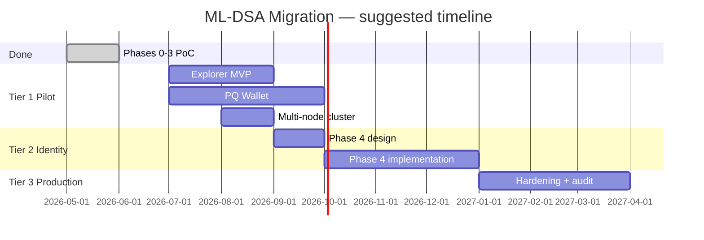

# ML-DSA Migration — Overview & Status

**Audience:** management, product, and engineering leads — the single page to
present the project. **Main goal:** replace the chain's signature algorithm from
**Ed25519** to **ML-DSA-44** (post-quantum, NIST FIPS 204). **Updated:** July
2026

> This is the **authoritative status + roadmap** for the migration. For the
> technical rationale see [`strategy.md`](./strategy.md); for per-phase
> engineering detail see [`implementation.md`](./implementation.md); for
> commands see [`runbook.md`](./runbook.md); for term definitions see
> [`glossary.md`](./glossary.md).

---

## The goal in one sentence

Build a **quantum-resistant blockchain** on infrastructure we control by
migrating every place the validator signs or verifies data from **Ed25519** to
**ML-DSA-44**.

This is a **self-hosted fork** — it does **not** connect to public Solana
mainnet, and by design it never will (see
[Out of scope](#explicitly-out-of-scope)).

---

## Why we are doing this

| Driver                    | Detail                                                                                                                                                      |
| ------------------------- | ----------------------------------------------------------------------------------------------------------------------------------------------------------- |
| **Quantum threat**        | Future quantum computers could break Ed25519. ML-DSA-44 is NIST-standardized and designed to resist that.                                                   |
| **Strategic positioning** | A working post-quantum (PQ) chain on infrastructure we own demonstrates capability before the industry-wide migration.                                      |
| **Scope boundary**        | Viable on **our own network** because we can change packet sizes and wire formats. **Not** viable on live Solana without every node in the world upgrading. |

---

## Why this is not a simple swap

|                | Ed25519 (today)   | ML-DSA-44 (target)                  |
| -------------- | ----------------- | ----------------------------------- |
| **Security**   | Fast, widely used | Resistant to future quantum attacks |
| **Public key** | 32 bytes          | 1,312 bytes                         |
| **Signature**  | 64 bytes          | 2,420 bytes                         |

Because signatures are ~40× larger, two assumptions Solana was built on break,
and both are solvable only on a network we control:

1. **Account address = public key** — a 1,312-byte key cannot be a 32-byte
   address. **Fix:** `address = sha256(public_key)`; the full key travels inside
   the transaction.
2. **A whole transaction fits in one ~1,232-byte packet** — one ML-DSA signature
   alone is ~3,700 bytes. **Fix:** packet limit raised to **8,192 bytes** on our
   fork (this is what makes it incompatible with mainnet, by design).

The deeper "why" — the two walls and how each surface is approached — is in
[`strategy.md`](./strategy.md).

---

## Five signature surfaces — status dashboard

Every node signs or verifies five different things. Each was an independent
upgrade decision. **All five are upgraded at proof-of-concept (PoC) level and
verified on a local test network.**

| #   | Surface                           | Business meaning                            | Status           | How to enable                                                                  |
| --- | --------------------------------- | ------------------------------------------- | ---------------- | ------------------------------------------------------------------------------ |
| 0   | **App-level verify** (precompile) | On-chain programs can verify a PQ signature | ✅ **Done**      | Built in; demo `demo.sh`                                                       |
| 1   | **User payments**                 | Wallets send SOL with PQ signatures         | ✅ **Done**      | Automatic when a tx uses the PQ format                                         |
| 2   | **Validator votes**               | Consensus / block finalization              | ✅ **Done**      | `--ml-dsa-vote` flag                                                           |
| 2b  | **Node gossip**                   | Validators discover and trust each other    | ✅ **Core done** | Transport + verify proven; a node does not yet sign its _own_ identity with PQ |
| 3   | **Block shreds**                  | Leader attests to the blocks it publishes   | ✅ **Done**      | `--ml-dsa-shred` flag                                                          |

**Current operating mode:** Ed25519 remains the **default everywhere**. PQ is
**opt-in per feature**, so the node never stalls during rollout.

---

## Progress summary

**What "complete" means depends on the target:**

| Target                                                 | Status            | Confidence                                             |
| ------------------------------------------------------ | ----------------- | ------------------------------------------------------ |
| **Demo / R&D network** (prove PQ works end-to-end)     | **~90% complete** | High — live demos exist for every phase                |
| **Pilot network** (multi-node, wallets, explorer)      | **~40% complete** | Medium — core validator done; ecosystem tooling needed |
| **Production PQ-only network** (no Ed25519 dependency) | **~25% complete** | Low — Phase 4 identity/TLS work not started            |

**Bottom line for leadership:** the hard technical proof is **done**. Remaining
work is **hardening, ecosystem tooling, and a full identity cutover** — not
inventing the cryptography.

---

## What has been delivered (by phase)

Terser than the engineering notes — for files/flags/caveats per phase see
[`implementation.md`](./implementation.md).

| Phase                      | Delivered                                                                                                                                                                                          | Verified how                                      |
| -------------------------- | -------------------------------------------------------------------------------------------------------------------------------------------------------------------------------------------------- | ------------------------------------------------- |
| **0 — On-chain verify**    | ML-DSA-44 precompile (PQ equivalent of the ed25519 verify hook); valid sig accepted, tampered rejected                                                                                             | Unit + integration + NIST FIPS 204 KAT + live RPC |
| **1 — User payments**      | New tx wire format (coexists via a `0x00` marker); a PQ fee payer sends SOL; RPC validates PQ txs before submission. _Single signer, legacy message only._                                         | Unit + bank-execution + live transfer demo        |
| **2 — Validator votes**    | Validator signs its own consensus votes with ML-DSA-44; chain produces, confirms, and **finalizes** on them                                                                                        | Unit + single-node live vote demo                 |
| **2b — Gossip (core)**     | Gossip CRDS values can carry a PQ signature + address binding; verified between two live nodes. _A node does not yet sign its own identity with PQ._                                               | Unit + 2-node live wire test                      |
| **3 — Block broadcasting** | Block shreds carry an additional PQ attestation per erasure batch; advisory verify by default, strict mode drops invalid PQ shreds. Hardened (erasure recovery, final-set signing, strict option). | Unit + single-node produce + offline verify       |

**Supporting infrastructure ✅:** SDK types (keypair, signature, public key,
transaction); `solana-keygen --scheme mldsa44`; compute-unit pricing for PQ
verify (~2.3× Ed25519); GPU sigverify fallback to CPU for PQ packets; live demo
scripts for every phase; engineering documentation.

---

## What remains

Grouped by **business outcome**, not code module. Blockers and the engineering
unblocking plan are detailed in [`remaining-work.md`](./remaining-work.md).

### Tier 1 — Finish the demo / pilot network _(recommended next)_

| Work item                          | Why it matters                                                                                         | Effort                   |
| ---------------------------------- | ------------------------------------------------------------------------------------------------------ | ------------------------ |
| **Block explorer** (Solscan-style) | Stakeholders need to see PQ transactions on-chain — see [`explorer-roadmap.md`](./explorer-roadmap.md) | Medium (6–10 weeks)      |
| **Browser / mobile wallet**        | Payments are useless without a wallet people can use                                                   | Medium–High (8–12 weeks) |
| **Multi-node test cluster**        | Prove PQ works with 3+ validators, not just one machine                                                | Medium (4–6 weeks)       |
| **Fix pre-existing test failures** | ~13 unit tests fail due to the packet-size change; no functional blocker but hurts CI confidence       | Low (1–2 weeks)          |

### Tier 2 — Phase 4: full validator identity cutover _(strategic, not started)_

The **largest remaining engineering block.** Today the node's network identity
(QUIC/TLS, repair, turbine handshakes) is still Ed25519.

| Work item                                                 | Why it matters                                   | Effort                            | Risk                                |
| --------------------------------------------------------- | ------------------------------------------------ | --------------------------------- | ----------------------------------- |
| **PQ node identity**                                      | Node authenticates as a PQ address, not a hybrid | High (12–16 weeks)                | High — can partition nodes if wrong |
| **TLS / QUIC certificate redesign**                       | Current certs require Ed25519 secret keys        | High                              | Blocks PQ-only networking           |
| **Node signs its own gossip identity with PQ**            | Completes surface 2b                             | Medium (depends on identity work) | Medium                              |
| **Replace Ed25519 liveness shred signature with PQ-only** | True PQ block broadcast (today PQ is additive)   | High                              | Medium — ~2× shred volume already   |

### Tier 3 — Production hardening _(after pilot)_

| Work item                                         | Why it matters                                | Effort                 |
| ------------------------------------------------- | --------------------------------------------- | ---------------------- |
| **Multi-signer PQ transactions**                  | Real apps often need multiple signers         | Medium                 |
| **v0 transactions + address lookup tables**       | Modern Solana app compatibility               | Medium–High            |
| **PQ-only network mode**                          | Turn off Ed25519 entirely                     | Medium (after Phase 4) |
| **Performance optimization** (GPU/CUDA PQ verify) | PQ verify is CPU-heavy; no hardware fast-path | Ongoing                |
| **Operational runbooks**                          | Key rotation, monitoring, incident response   | Low–Medium             |
| **Security audit**                                | External review before any production launch  | 4–8 weeks (vendor)     |

### Explicitly out of scope

| Item                                | Reason                                                      |
| ----------------------------------- | ----------------------------------------------------------- |
| Public Solana mainnet compatibility | Packet size and wire format differ by design                |
| Matching current mainnet throughput | PQ signatures are larger and slower (no hardware fast-path) |

---

## Roadmap

| Period             | Focus                                         |
| ------------------ | --------------------------------------------- |
| **Jul – Sep 2026** | Explorer MVP, PQ wallet, 3+ validator testnet |
| **Sep – Dec 2026** | Phase 4 — PQ node identity and TLS            |
| **Q1 2027**        | Production hardening and external audit       |

_Timeline is indicative — adjust to team size and priorities._

---

## Risks and decisions for leadership

| Risk                                  | Impact                           | Mitigation                                               | Decision needed?             |
| ------------------------------------- | -------------------------------- | -------------------------------------------------------- | ---------------------------- |
| **Not compatible with public Solana** | Cannot deploy on mainnet         | By design — self-hosted only                             | Accept scope                 |
| **Lower throughput vs Ed25519**       | Slower tx processing             | Acceptable for PoC; priced into the compute model (done) | Accept for pilot             |
| **Hybrid Ed25519 + PQ complexity**    | Two code paths to maintain       | Flag-gated coexistence until Phase 4                     | Approve phased cutover       |
| **No end-user wallet yet**            | PQ payments only via CLI/demos   | Fund wallet work (Tier 1)                                | **Yes — prioritize?**        |
| **Phase 4 identity work is large**    | Delays "PQ-only" network         | Defer until pilot proves value                           | **Yes — is PQ-only a goal?** |
| **Team knowledge concentration**      | Bus factor on fork-specific code | Document + handoff sessions                              | Ongoing                      |

**Recommended decisions:**

1. **Define the target state** — demo network? pilot with users? PQ-only
   production? Each has a different cost and timeline.
2. **Approve Tier 1 funding** (explorer + wallet + multi-node) if the next
   milestone is a visible pilot network.
3. **Defer Phase 4** until Tier 1 is live, unless a hard requirement exists for
   PQ-only node identity sooner.
4. **Accept non-mainnet scope** — this fork will not interoperate with public
   Solana.

---

## How to see it working

Engineering can run one-command live demos (each boots a test network, runs a
real PQ flow printing real keys/signatures + raw JSON-RPC, then tears down):

| Demo               | Shows                              |
| ------------------ | ---------------------------------- |
| `demo.sh`          | PQ signature verified on-chain     |
| `demo-transfer.sh` | PQ-signed payment confirms         |
| `demo-vote.sh`     | Chain finalizes on PQ votes        |
| `demo-shred.sh`    | Blocks carry valid PQ attestations |

Full step-by-step (scripts + manual CLI) is in [`runbook.md`](./runbook.md).

---

## Key takeaway for presentations

> **The signature migration is proven in the validator (Phases 0–3).** > **What
> remains:** user-facing tools (explorer, wallet), multi-node testing, then
> Phase 4 to remove the last Ed25519 dependencies for a PQ-only network.
