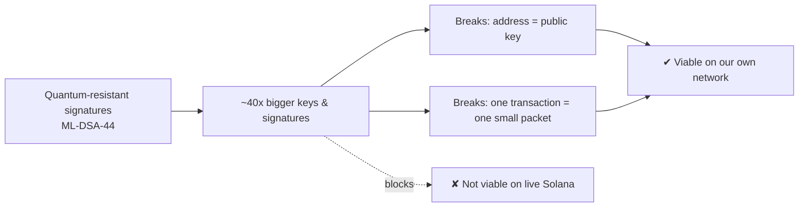
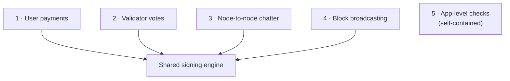
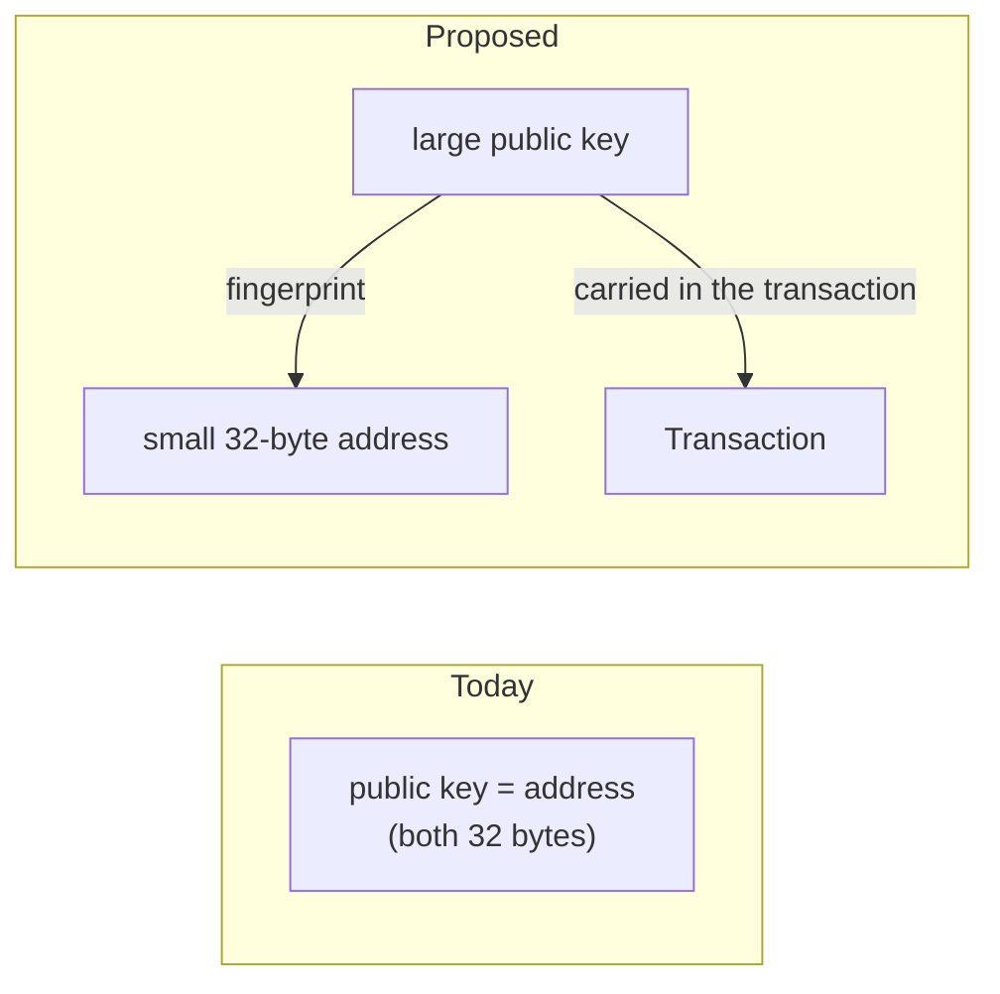
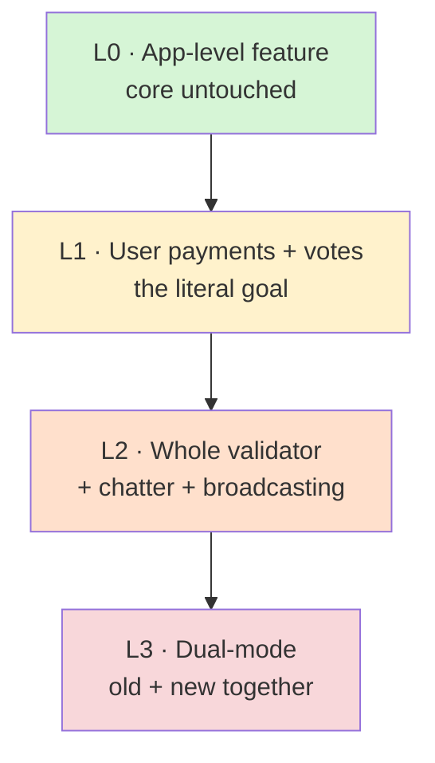
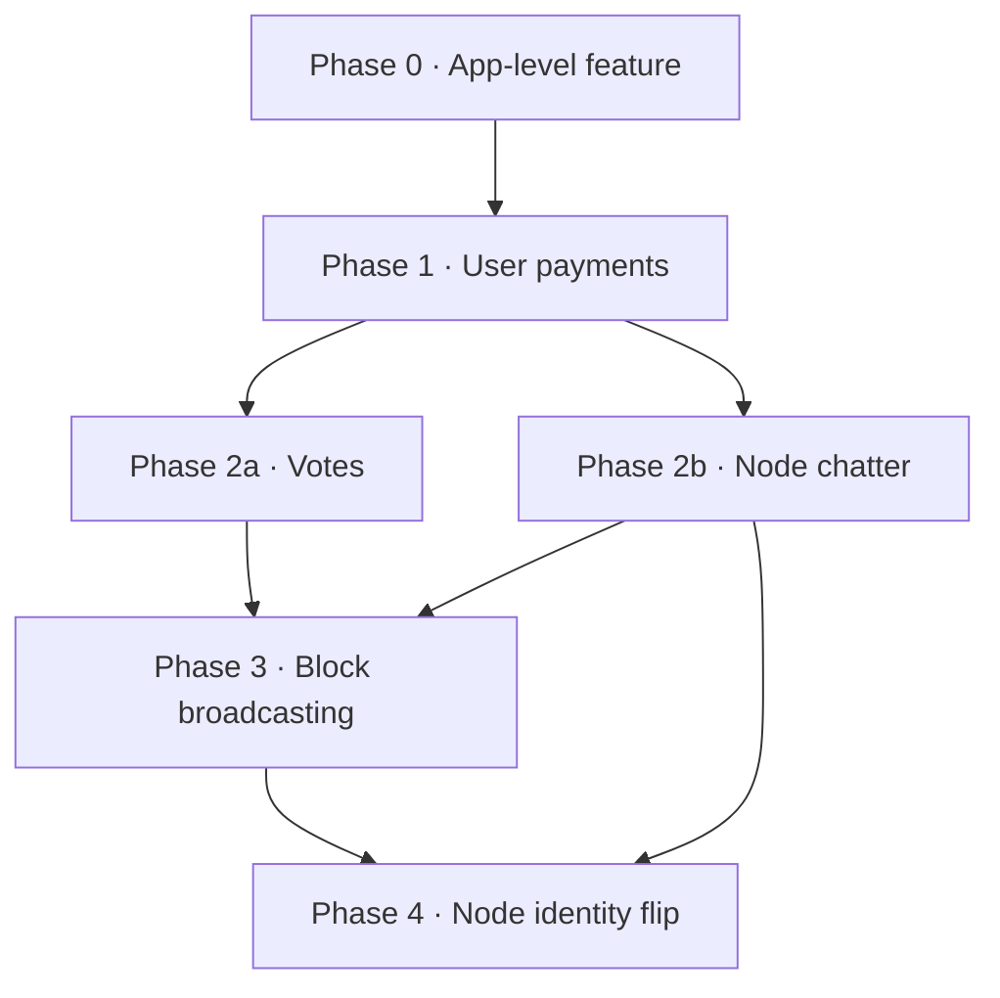

# ML-DSA-44 Migration — Strategy & Design

> **This is the design & rationale doc** — _why_ the migration is hard and _how_
> each of the five surfaces is approached. **In one line:** replace the
> validator's signature algorithm with a quantum-resistant one — feasible on our
> own network, not on live Solana.
>
> For live **status, progress, and the roadmap** see
> [`overview.md`](./overview.md) · for **per-phase engineering detail** (files,
> flags, caveats) see [`implementation.md`](./implementation.md) · for
> **commands** see [`runbook.md`](./runbook.md) · for **terms** see
> [`glossary.md`](./glossary.md).

---

## TL;DR

We want to replace the signature algorithm our validator uses — today
**Ed25519** — with **ML-DSA-44**, a quantum-resistant signature standardized by
NIST. The math swap is easy. The challenge is that the new keys and signatures
are **~40× larger**, and the system was built assuming signatures are tiny.

Three things to know:

1. **There isn't one signature to change — there are five.** The network signs
   five separate things (user payments, validator votes, node-to-node chatter,
   block broadcasting, and an app-level verify hook). We can upgrade any subset.
2. **Two core assumptions break** under big keys: an account's _address is
   literally its public key_ (impossible at 1312 bytes), and a _whole
   transaction must fit in one small network packet_ (one new signature alone is
   bigger than that packet). Both are solvable on a network we control.
3. **What's realistic:** a self-hosted demo network proving quantum-resistant
   **user payments** end to end. **Not realistic:** staying compatible with the
   live public Solana network, or matching today's transaction speeds.

**Recommended path:** start with the smallest, self-contained piece (an
app-level verification feature — a low-risk proof the technology works), then do
**user payments** (the real foundation), after which **votes** come almost for
free. Node chatter and block broadcasting are heavier and optional.



---

## 1. Why it's hard: the size problem

The new scheme is far larger than today's:

|            | Today (Ed25519) | Target (ML-DSA-44) | Bigger by |
| ---------- | --------------: | -----------------: | --------: |
| Public key |        32 bytes |    **1,312 bytes** |      ~41× |
| Signature  |        64 bytes |    **2,420 bytes** |      ~38× |

Signing and verifying work the same way conceptually. **All the effort is in
absorbing that bulk** everywhere the system assumed signatures were small.

---

## 2. The five things we'd be upgrading

The network signs five separate things. Each is an independent decision.



| #   | Surface                  | What it is                                                                              |
| --- | ------------------------ | --------------------------------------------------------------------------------------- |
| 1   | **User payments**        | Wallets signing transactions. The headline use case.                                    |
| 2   | **Validator votes**      | How validators agree on the chain. High volume — _a vote is just a transaction_.        |
| 3   | **Node-to-node chatter** | How validators find and trust each other.                                               |
| 4   | **Block broadcasting**   | The block producer signing what it publishes.                                           |
| 5   | **App-level checks**     | Letting on-chain apps verify a signature on request. The only fully self-contained one. |

**Why this matters for planning:** surfaces 1–4 share one signing engine —
change it once and votes and chatter largely come along. Only #5 is truly
independent, which is why it's the safest place to start.

---

## 3. The two things that make it hard

### Wall #1 — an account's address _is_ its public key

Today, the same 32-byte value is _both_ your public key and your account address
(the thing people send funds to). That only works because today's keys are
small. A 1,312-byte key can't be an address.

The fix is standard (it's how Bitcoin works): keep addresses small by making the
address a **fingerprint (hash) of the key**, and carry the full key inside the
transaction.



**Verdict: solvable** — a well-known pattern. Cost: transactions must now carry
the big key.

### Wall #2 — a whole transaction must fit in one small packet

The system caps an **entire transaction** at ~1,232 bytes so it fits in a single
internet packet. One ML-DSA signature plus its key is already ~3,700 bytes —
about **3× too big** before anything else is added.

```text
   Packet budget:  ~1,232 bytes  ────────────────┐
   One new signature + key:  ~3,732 bytes  ───────────────────────────┘  (3x over)
```

That 1,232 limit is **a number we chose**, not a law of nature — picked so
transactions cross the public internet cleanly. On a network we control, we can
raise it (the fork sets `PACKET_DATA_SIZE = 8192`). The **only** thing that's
impossible is raising it _while staying compatible with live Solana_, because we
can't change the limit on everyone else's machines.

**Verdict: solvable on our own network; impossible against live Solana.**

---

## 4. How far we could take it



| Level  | Reach                                                | Effort                                |
| ------ | ---------------------------------------------------- | ------------------------------------- |
| **L0** | Add a quantum-resistant verify feature apps can call | Low — core untouched                  |
| **L1** | Upgrade user payments (votes ride along)             | High — the foundational lift          |
| **L2** | Also chatter + block broadcasting                    | Higher — fully quantum-resistant node |
| **L3** | Run old and new side by side                         | Highest — most production-realistic   |

---

## 5. Order of difficulty

| Order | Surface                  | Effort          | Why                                                                                                                                |
| ----- | ------------------------ | --------------- | ---------------------------------------------------------------------------------------------------------------------------------- |
| 1     | **App-level checks**     | 🟢 Easy         | Self-contained; a safe warm-up that proves the technology                                                                          |
| 2     | **Validator votes**      | 🟢 Easy (gated) | Almost free once payments work — a vote _is_ a transaction                                                                         |
| 3     | **Node-to-node chatter** | 🟡 Medium       | Gossip CRDS values are signable/verifiable; a node signing its _own_ identity is entangled with the shared node identity (Phase 4) |
| 4     | **User payments**        | 🟠 Hard         | Where both walls get solved — the linchpin                                                                                         |
| 5     | **Block broadcasting**   | 🔴 Hardest      | The signature is bigger than a whole block fragment; a real redesign                                                               |

**Note:** _easiest_ is not _first to matter_. The real spine is user payments
(#4); votes and a meaningful demo can't exist without it. Live status of each
surface is in [`overview.md`](./overview.md).

---

## 6. What's realistic vs not

| Goal                                                         | Realistic?                                       |
| ------------------------------------------------------------ | ------------------------------------------------ |
| Add a quantum-resistant app-level verify feature             | ✅ Easily                                        |
| Quantum-resistant **user payments** on our own network       | ✅ Yes                                           |
| A fully quantum-resistant validator (chatter + broadcasting) | ⚠️ Harder, but yes                               |
| Interoperate with the **live** Solana network                | ❌ No — others enforce the old format            |
| Match today's transaction throughput                         | ❌ No — bigger signatures, no hardware fast-path |

---

## 7. Recommended roadmap (dependency view)

The phases and their dependencies. **Live status and the dated roadmap are owned
by [`overview.md`](./overview.md)**; the per-phase engineering detail is in
[`implementation.md`](./implementation.md).



Phase 4 (flip the node identity itself to an ML-DSA address) is the frontier —
blocked today by the QUIC/TLS Ed25519 certificate wall and the fixed-width
Ping/Pong/PruneData signatures. Its unblocking plan is in
[`remaining-work.md`](./remaining-work.md).

---

## 8. Risks

| Risk                                                                         | Impact    | Mitigation                                                                                                                                                                                                                                                                                                                                                                                                                                 |
| ---------------------------------------------------------------------------- | --------- | ------------------------------------------------------------------------------------------------------------------------------------------------------------------------------------------------------------------------------------------------------------------------------------------------------------------------------------------------------------------------------------------------------------------------------------------ |
| **Throughput drops** (signatures ~40× bigger, no hardware fast-path)         | Medium    | Accepted for a PoC, now **measured & priced**: ML-DSA-44 verify ≈ **2.3× ed25519** (median of same-host bench runs) → `ML_DSA_VERIFY_COST = 5310 CU` in `cost-model/src/block_cost_limits.rs`                                                                                                                                                                                                                                              |
| **Not compatible with live Solana**                                          | By design | Out of scope — self-hosted only                                                                                                                                                                                                                                                                                                                                                                                                            |
| **New-vs-sample mismatch** (must match the reference implementation exactly) | High      | ✅ **Mitigated.** A NIST FIPS 204 known-answer + cross-implementation suite (`programs/ml-dsa-tests/tests/fips204_vectors.rs` + `cross-impl/check_vectors.mjs`) pins our `MlDsaKeypair` keygen and the `fips204` sign/verify core to the official NIST ACVP vectors (vendored in `fips204` 0.4.6) **and** proves the Rust validator and the sibling `@noble/post-quantum` JS wallet produce byte-identical keys/signatures (empty context) |
| **Block-broadcasting redesign** is large                                     | High      | Delivered additively (per FEC set, not per fragment) — see Phase 3 in [`implementation.md`](./implementation.md)                                                                                                                                                                                                                                                                                                                           |
| **Multi-signer transactions balloon** (~3.7 KB each signer)                  | Medium    | Cap signers per transaction; document the limit                                                                                                                                                                                                                                                                                                                                                                                            |
| **Wallet/key tooling changes**                                               | Medium    | Handled in Phase 1; keep a clear key format                                                                                                                                                                                                                                                                                                                                                                                                |

---

## 9. Technology choice

The new scheme follows **NIST FIPS 204** (finalized August 2024). We use a
mature, pure-Rust implementation of it (the `fips204` library, pinned at
`0.4.6`) that is compatible with our existing build toolchain and byte-for-byte
matches the reference sample we already have. An alternative library was ruled
out for needing a newer toolchain than ours; an older one was ruled out for not
matching the final standard.

---

## 10. Run it yourself

Every delivered phase ships a self-contained live demo (each boots a throwaway
local validator, runs a narrated flow printing real keys/signatures and raw
JSON-RPC, then tears down). The full command set — scripts and the manual
two-terminal pattern — lives in [`runbook.md`](./runbook.md).

---

_Design & rationale only. Current status → [`overview.md`](./overview.md);
what's still pending → [`remaining-work.md`](./remaining-work.md); per-phase
engineering notes → [`implementation.md`](./implementation.md)._
