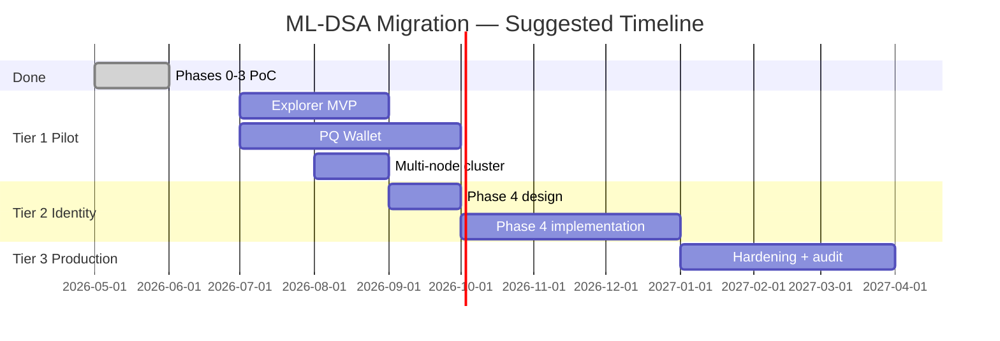

# ML-DSA-44 Migration — Status & Remaining Work

**Audience:** Management, product, and engineering leads  
**Last updated:** June 2026  
**Technical deep-dive:** [`ml-dsa-migration.md`](./ml-dsa-migration.md) · **Engineering runbook:** [`../CLAUDE.md`](../CLAUDE.md)

---

## Executive summary

This project migrates our **self-hosted Solana validator fork** from **Ed25519** (today’s standard) to **ML-DSA-44** (NIST post-quantum standard). The goal is a **quantum-resistant blockchain** we control — **not** compatibility with the public Solana mainnet.

**Where we are today:** All five signature surfaces have been upgraded at **proof-of-concept (PoC)** level and verified on a local test network. The chain can process post-quantum payments, votes, gossip messages, and block attestations while still running normally on Ed25519 by default.

**What “complete” means depends on the target:**

| Target | Status | Confidence |
|--------|--------|------------|
| **Demo / R&D network** (prove PQ works end-to-end) | **~90% complete** | High — live demos exist for every phase |
| **Pilot network** (multi-node, wallets, explorer) | **~40% complete** | Medium — core validator done; ecosystem tooling needed |
| **Production PQ-only network** (no Ed25519 dependency) | **~25% complete** | Low — Phase 4 identity/TLS work not started |

**Bottom line for leadership:** The hard technical proof is **done**. Remaining work is **hardening, ecosystem tooling, and a full identity cutover** — not inventing the cryptography from scratch.

---

## Why we are doing this

| Driver | Detail |
|--------|--------|
| **Quantum threat** | Future quantum computers could break Ed25519. ML-DSA-44 is NIST-standardized and designed to resist that. |
| **Strategic positioning** | A working PQ chain on infrastructure we own demonstrates capability before the industry-wide migration. |
| **Scope boundary** | This is viable on **our own network** because we can change packet sizes and wire formats. It is **not** viable on live Solana without every node in the world upgrading. |

---

## The problem in plain terms

ML-DSA signatures and keys are roughly **40× larger** than Ed25519. Solana was built assuming signatures are tiny. That breaks two rules:

1. **Account address = public key** — a 1,312-byte key cannot be an address.  
   **Fix applied:** address = hash of the public key; full key travels inside the transaction.

2. **Whole transaction fits in one small network packet (~1,232 bytes)** — one ML-DSA signature alone is ~3,700 bytes.  
   **Fix applied:** packet limit raised to **8,192 bytes** on our fork (breaks mainnet wire compatibility by design).

---

## Five signature surfaces — status dashboard

The validator signs five different things. Each was an independent upgrade decision.

| # | Surface | Business meaning | Status | How to enable |
|---|---------|------------------|--------|---------------|
| 0 | **App-level verify** | On-chain programs can verify a PQ signature | ✅ **Done** | Built into validator; demo: `demo.sh` |
| 1 | **User payments** | Wallets send SOL with PQ signatures | ✅ **Done** | Automatic when tx uses PQ format |
| 2 | **Validator votes** | Consensus / block finalization | ✅ **Done** | `--ml-dsa-vote` flag |
| 2b | **Node gossip** | Validators discover and trust each other | ✅ **Core done** | Transport + verify proven; node does not yet sign its own identity with PQ |
| 3 | **Block shreds** | Leader attests to blocks it publishes | ✅ **Done** | `--ml-dsa-shred` flag |

**Current operating mode:** Ed25519 remains the **default everywhere**. Post-quantum is **opt-in per feature** so the node never stalls during rollout.

---

## What has been delivered (by phase)

### Phase 0 — On-chain verification ✅

- ML-DSA-44 precompile (post-quantum equivalent of the existing ed25519 verify hook).
- NIST conformance tests + cross-check against JavaScript reference implementation.
- Live demo confirms a valid PQ signature on-chain; rejects tampered signatures.

### Phase 1 — User payments ✅

- New transaction wire format (coexists with Ed25519; marked by a leading `0x00` byte).
- Post-quantum fee payer can send SOL transfers.
- RPC `sendTransaction` validates PQ transactions before submission.
- **Limitation today:** single signer only; no v0 / address-lookup-table transactions.

### Phase 2 — Validator votes ✅

- Validator can sign its own consensus votes with ML-DSA-44.
- Chain produces, confirms, and finalizes blocks on PQ votes (verified live).
- **Limitation today:** best proven on single-node setup; multi-node propagation is via block replay, not gossip.

### Phase 2b — Gossip ✅ (core)

- Gossip messages can carry PQ signatures; verified between two live nodes.
- **Not done:** a node signing its **own** network identity with PQ (blocked by identity/TLS design — see Phase 4).

### Phase 3 — Block broadcasting ✅

- Block shreds can carry an additional PQ attestation per erasure batch.
- Advisory verification by default; strict mode drops invalid PQ shreds (`--ml-dsa-shred-strict`).
- Hardening complete: erasure recovery, final-block signing, strict enforcement option.

### Supporting infrastructure ✅

| Item | Status |
|------|--------|
| SDK types (keypair, signature, public key, transaction) | Done |
| `solana-keygen --scheme mldsa44` | Done |
| Compute-unit pricing for PQ verify (~2.3× Ed25519 cost) | Done |
| GPU sigverify fallback to CPU for PQ packets | Done |
| Live demo scripts for all phases | Done |
| Engineering documentation | Done |

---

## What remains to complete the migration

Work is grouped by **business outcome**, not code module.

### Tier 1 — Finish the demo / pilot network *(recommended next)*

| Work item | Why it matters | Effort | Owner |
|-----------|----------------|--------|-------|
| **Block explorer** (Solscan-style) | Users and stakeholders need to see PQ transactions on-chain | Medium (6–10 weeks) | Product + frontend — see [`ml-dsa-explorer-roadmap.md`](./ml-dsa-explorer-roadmap.md) |
| **Browser / mobile wallet** | Payments are useless without a wallet people can use | Medium–High (8–12 weeks) | Wallet team; `@noble/post-quantum` reference exists |
| **Multi-node test cluster** | Prove PQ works with 3+ validators, not just one machine | Medium (4–6 weeks) | Infrastructure |
| **Fix pre-existing test failures** | 13 unit tests fail due to packet-size change; no functional blocker but hurts CI confidence | Low (1–2 weeks) | Engineering |

### Tier 2 — Phase 4: full validator identity cutover *(strategic, not started)*

This is the **largest remaining engineering block**. Today the node’s network identity (QUIC/TLS, repair, turbine handshakes) is still Ed25519.

| Work item | Why it matters | Effort | Risk |
|-----------|----------------|--------|------|
| **PQ node identity** | Node authenticates as a PQ address, not a hybrid | High (12–16 weeks) | High — can partition nodes from the network if wrong |
| **TLS / QUIC certificate redesign** | Current certs require Ed25519 secret keys | High | Blocks PQ-only networking |
| **Node signs its own gossip identity with PQ** | Completes surface #2b | Medium (depends on identity work) | Medium |
| **Replace Ed25519 liveness shred signature with PQ-only** | True PQ block broadcast (today PQ is additive) | High | Medium — ~2× shred volume already |

### Tier 3 — Production hardening *(after pilot)*

| Work item | Why it matters | Effort |
|-----------|----------------|--------|
| **Multi-signer PQ transactions** | Real apps often need multiple signers | Medium |
| **v0 transactions + address lookup tables** | Modern Solana app compatibility | Medium–High |
| **PQ-only network mode** | Turn off Ed25519 entirely | Medium (after Phase 4) |
| **Performance optimization** | PQ verify is CPU-heavy; no hardware fast-path | Ongoing |
| **Operational runbooks** | Key rotation, monitoring, incident response | Low–Medium |
| **Security audit** | External review before any production launch | 4–8 weeks (vendor) |

---

## Roadmap view



*Timeline is indicative. Adjust based on team size and priorities.*

---

## Risks and decisions for leadership

| Risk | Impact | Mitigation | Decision needed? |
|------|--------|------------|----------------|
| **Not compatible with public Solana** | Cannot deploy on mainnet | By design — self-hosted only | Accept scope |
| **Lower throughput vs Ed25519** | Slower tx processing | Acceptable for PoC; price into compute model (done) | Accept for pilot |
| **Hybrid Ed25519 + PQ complexity** | Two code paths to maintain | Flag-gated coexistence until Phase 4 | Approve phased cutover |
| **No end-user wallet yet** | PQ payments only via CLI/demos | Fund wallet work (Tier 1) | **Yes — prioritize?** |
| **Phase 4 identity work is large** | Delays “PQ-only” network | Defer until pilot proves value | **Yes — is PQ-only a goal?** |
| **Team knowledge concentration** | Bus factor on fork-specific code | Document + handoff sessions | Ongoing |

---

## How we verify progress today

Anyone on the engineering team can run these **one-command live demos** (requires a built validator):

```bash
bash programs/ml-dsa-tests/demo.sh            # Phase 0 — on-chain PQ verify
bash programs/ml-dsa-tests/demo-transfer.sh # Phase 1 — PQ payment
bash programs/ml-dsa-tests/demo-vote.sh     # Phase 2 — PQ validator votes
bash programs/ml-dsa-tests/demo-shred.sh    # Phase 3 — PQ block attestation
```

Each demo prints real keys, signatures, and raw JSON-RPC traffic — nothing is staged.

---

## Recommended management decisions

1. **Define the target state:** Demo network? Pilot with users? PQ-only production? Each has a different cost and timeline.
2. **Approve Tier 1 funding** (explorer + wallet + multi-node) if the next milestone is a **visible pilot network**.
3. **Defer Phase 4** until Tier 1 is live unless a hard requirement exists for PQ-only node identity in the near term.
4. **Accept non-mainnet scope** — this fork will not interoperate with public Solana.

---

## Glossary (for non-technical readers)

| Term | Plain meaning |
|------|---------------|
| **Ed25519** | Today’s fast, small signature algorithm used by Solana |
| **ML-DSA-44** | NIST post-quantum replacement; much larger keys and signatures |
| **Precompile** | Built-in on-chain verify function (no custom program needed) |
| **Validator** | Server that processes transactions and produces blocks |
| **Gossip** | How validators find and communicate with each other |
| **Shred** | Small fragment of a block sent over the network |
| **PoC** | Proof of concept — works in controlled conditions, not yet production-hardened |

---

## Related documents

| Document | Purpose |
|----------|---------|
| [`ml-dsa-migration.md`](./ml-dsa-migration.md) | Full technical strategy and phase definitions |
| [`ml-dsa-explorer-roadmap.md`](./ml-dsa-explorer-roadmap.md) | Plan for a Solscan-style block explorer |
| [`../CLAUDE.md`](../CLAUDE.md) | Engineering build/run instructions |
