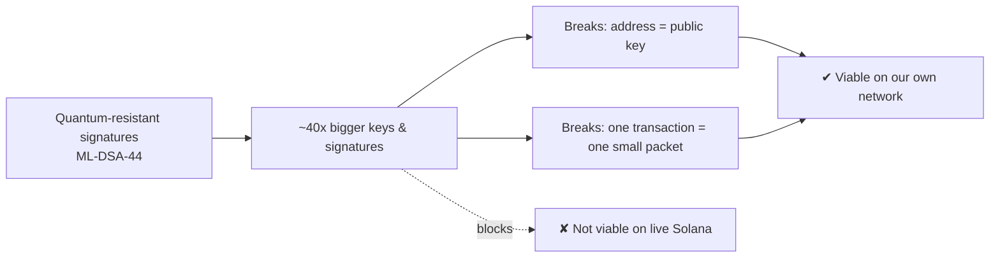
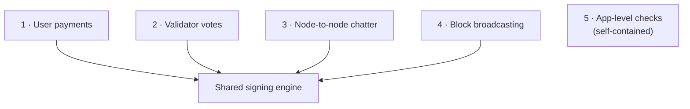
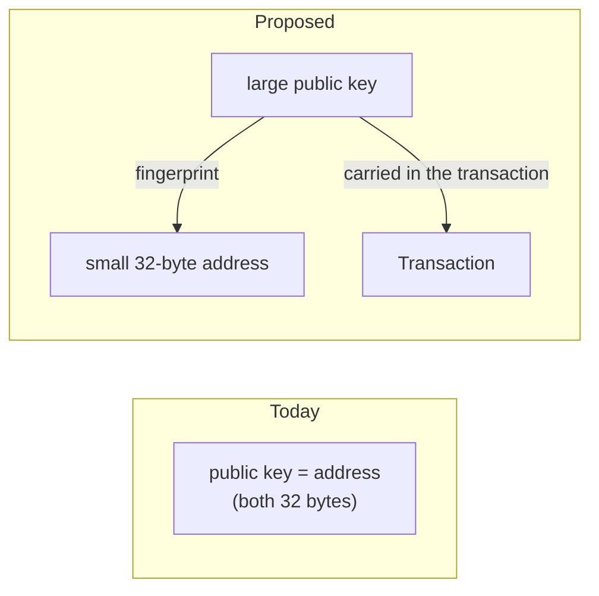
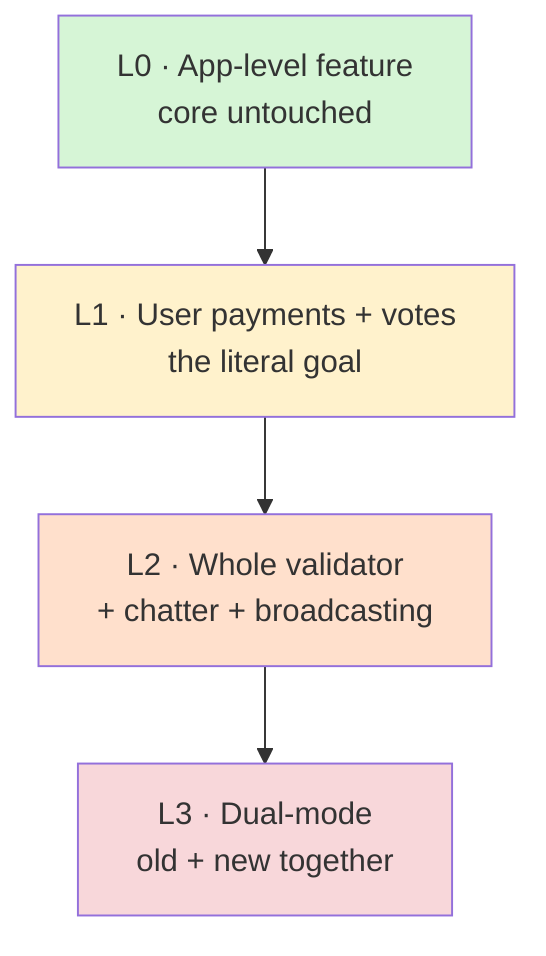
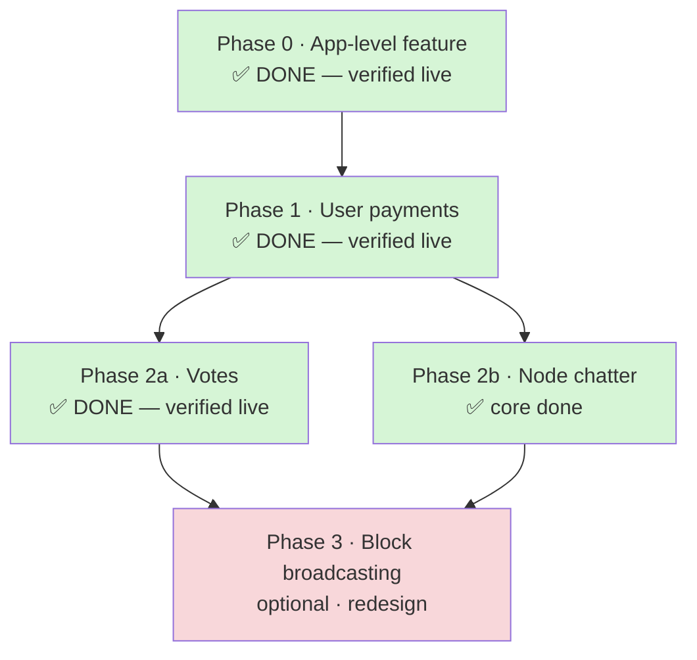

# Migrating to Post-Quantum Signatures (ML-DSA-44)

> **Status:** Phases 0–2a delivered & verified (app-level feature + post-quantum
> user payments + post-quantum validator votes); Phase 2b (gossip CRDS signing)
> core delivered & verified · **Phase 3 (block broadcasting / shreds) delivered &
> verified** (additive ML-DSA-44 shred signing + verify, flag-gated `--ml-dsa-shred`) ·
> **Date:** 2026-06-09 **In one line:** replace the validator's signature
> algorithm with a quantum-resistant one — feasible on our own network, not on
> live Solana.

---

## TL;DR

We want to replace the signature algorithm our validator uses — today
**Ed25519** — with **ML-DSA-44**, a quantum-resistant signature standardized by
NIST. The math swap is easy. The challenge is that the new keys and signatures
are **~40× larger**, and the system was built assuming signatures are tiny.

Three things to know:

1. **There isn't one signature to change — there are five.** The network signs
   five separate things (user payments, validator votes, node-to-node chatter,
   block broadcasting, and an app-level verify hook). We can upgrade any subset.
2. **Two core assumptions break** under big keys: an account's _address is
   literally its public key_ (impossible at 1312 bytes), and a _whole
   transaction must fit in one small network packet_ (one new signature alone is
   bigger than that packet). Both are solvable on a network we control.
3. **What's realistic:** a self-hosted demo network proving quantum-resistant
   **user payments** end to end. **Not realistic:** staying compatible with the
   live public Solana network, or matching today's transaction speeds.

**Recommended path:** start with the smallest, self-contained piece (an
app-level verification feature — a low-risk proof the technology works), then do
**user payments** (the real foundation), after which **votes** come almost for
free. Node chatter and block broadcasting are heavier and optional.



---

## 1. Why it's hard: the size problem

The new scheme is far larger than today's:

|            | Today (Ed25519) | Target (ML-DSA-44) | Bigger by |
| ---------- | --------------: | -----------------: | --------: |
| Public key |        32 bytes |    **1,312 bytes** |      ~41× |
| Signature  |        64 bytes |    **2,420 bytes** |      ~38× |

Signing and verifying work the same way conceptually. **All the effort is in
absorbing that bulk** everywhere the system assumed signatures were small.

---

## 2. The five things we'd be upgrading

The network signs five separate things. Each is an independent decision.



| #   | Surface                  | What it is                                                                              |
| --- | ------------------------ | --------------------------------------------------------------------------------------- |
| 1   | **User payments**        | Wallets signing transactions. The headline use case.                                    |
| 2   | **Validator votes**      | How validators agree on the chain. High volume — _a vote is just a transaction_.        |
| 3   | **Node-to-node chatter** | How validators find and trust each other.                                               |
| 4   | **Block broadcasting**   | The block producer signing what it publishes.                                           |
| 5   | **App-level checks**     | Letting on-chain apps verify a signature on request. The only fully self-contained one. |

**Why this matters for planning:** surfaces 1–4 share one signing engine —
change it once and votes and chatter largely come along. Only #5 is truly
independent, which is why it's the safest place to start.

---

## 3. The two things that make it hard

### Wall #1 — an account's address _is_ its public key

Today, the same 32-byte value is _both_ your public key and your account address
(the thing people send funds to). That only works because today's keys are
small. A 1,312-byte key can't be an address.

The fix is standard (it's how Bitcoin works): keep addresses small by making the
address a **fingerprint (hash) of the key**, and carry the full key inside the
transaction.



**Verdict: solvable** — a well-known pattern. Cost: transactions must now carry
the big key.

### Wall #2 — a whole transaction must fit in one small packet

The system caps an **entire transaction** at ~1,232 bytes so it fits in a single
internet packet. One ML-DSA signature plus its key is already ~3,700 bytes —
about **3× too big** before anything else is added.

```text
   Packet budget:  ~1,232 bytes  ────────────────┐
   One new signature + key:  ~3,732 bytes  ───────────────────────────┘  (3x over)
```

That 1,232 limit is **a number we chose**, not a law of nature — picked so
transactions cross the public internet cleanly. On a network we control, we can
raise it. The **only** thing that's impossible is raising it _while staying
compatible with live Solana_, because we can't change the limit on everyone
else's machines.

**Verdict: solvable on our own network; impossible against live Solana.**

---

## 4. How far we could take it



| Level  | Reach                                                | Effort                                |
| ------ | ---------------------------------------------------- | ------------------------------------- |
| **L0** | Add a quantum-resistant verify feature apps can call | Low — core untouched                  |
| **L1** | Upgrade user payments (votes ride along)             | High — the foundational lift          |
| **L2** | Also chatter + block broadcasting                    | Higher — fully quantum-resistant node |
| **L3** | Run old and new side by side                         | Highest — most production-realistic   |

---

## 5. Order of difficulty

| Order | Surface                  | Effort                        | Why                                                                                                                                      |
| ----- | ------------------------ | ----------------------------- | ---------------------------------------------------------------------------------------------------------------------------------------- |
| 1     | **App-level checks**     | 🟢 Easy                       | Self-contained; a safe warm-up that proves the technology                                                                                |
| 2     | **Validator votes**      | 🟢 Easy (gated) · ✅ **DONE** | Almost free once payments work — a vote _is_ a transaction. Live: the validator's votes are post-quantum and the chain finalizes on them |
| 3     | **Node-to-node chatter** | 🟡 Medium · ✅ **core DONE**  | Gossip CRDS values are now ML-DSA-signable and verify between live nodes; a node signing its _own_ gossip identity is deferred to #5 (shared node identity)                                                                  |
| 4     | **User payments**        | 🟠 Hard · ✅ **DONE**         | Where both walls get solved — the linchpin. Live: an ML-DSA-signed transfer confirms on-chain                                            |
| 5     | **Block broadcasting**   | 🔴 Hardest                    | The signature is bigger than a whole block fragment; a real redesign                                                                     |

**Note:** _easiest_ is not _first to matter_. The real spine is user payments
(#4); votes and a meaningful demo can't exist without it.

---

## 6. What's realistic vs not

| Goal                                                         | Realistic?                                       |
| ------------------------------------------------------------ | ------------------------------------------------ |
| Add a quantum-resistant app-level verify feature             | ✅ Easily                                        |
| Quantum-resistant **user payments** on our own network       | ✅ Yes                                           |
| A fully quantum-resistant validator (chatter + broadcasting) | ⚠️ Harder, but yes                               |
| Interoperate with the **live** Solana network                | ❌ No — others enforce the old format            |
| Match today's transaction throughput                         | ❌ No — bigger signatures, no hardware fast-path |

---

## 7. Recommended roadmap



| Phase                      | "Done" means                                                                                                                                                                                                                                                                                                                                                                                                                                                                                 |
| -------------------------- | -------------------------------------------------------------------------------------------------------------------------------------------------------------------------------------------------------------------------------------------------------------------------------------------------------------------------------------------------------------------------------------------------------------------------------------------------------------------------------------------- |
| **0 — App-level feature**  | ✅ **Done & verified.** A valid ML-DSA-44 signature is accepted and a tampered one rejected — proven by unit + integration tests **and** live over RPC on a local `solana-test-validator` (a real ~3.9 KB signed transaction confirmed on-chain). Built on the `fips204` library; required raising the packet-size ceiling (1232 → 8192 bytes) so the larger signatures fit. The technology fits.                                                                                            |
| **1 — User payments**      | ✅ **Done & verified.** A fee payer signs a SOL transfer with ML-DSA-44 (its address = sha256(public key)); the validator verifies, executes, and confirms it live on `solana-test-validator`, and rejects a forged one. **Coexists** with Ed25519 (votes/gossip/shreds unchanged); single-signer, legacy message for now.                                                                                                                                                                   |
| **2a — Votes**             | ✅ **Done & verified.** The validator's own consensus votes are signed with ML-DSA-44 (post-quantum), riding the Phase 1 machinery. Live on a local validator: the vote authority is a post-quantum address (no old-style key exists for it), and the chain keeps producing, **confirming, and finalizing** blocks on these votes. It's **flag-gated and coexists** — default (flag off) is unchanged Ed25519 voting, so the node never stalls; switching is a restart, not a live hot-swap. |
| **2b — Node chatter**      | ✅ **Core done & verified.** Gossip CRDS values can carry a post-quantum signature: `CrdsValue.signature` is now a `CrdsSignature` enum (`Ed25519` \| `MlDsa{pubkey, signature}`); verification enforces the signature **and** the `sha256(public_key)==identity` binding; an ML-DSA-signed value propagates and verifies between two live gossip nodes (`gossip/tests/gossip.rs`). Ed25519 is byte-for-byte unchanged (coexists). **Deferred:** a node signing its _own_ gossip identity with ML-DSA needs the node identity to equal the ML-DSA address, which is entangled with shred signing → Phase 3. |
| **3 — Block broadcasting** | Blocks are signed/verified with the new scheme (likely per block, not per fragment).                                                                                                                                                                                                                                                                                                                                                                                                         |

---

## 8. Risks

| Risk                                                                         | Impact    | Mitigation                                                                                                                                                   |
| ---------------------------------------------------------------------------- | --------- | ------------------------------------------------------------------------------------------------------------------------------------------------------------ |
| **Throughput drops** (signatures ~40× bigger, no hardware fast-path)         | Medium    | Accepted for a PoC, now **measured & priced**: ML-DSA-44 verify ≈ **2.3× ed25519** (median of same-host bench runs) → `ML_DSA_VERIFY_COST = 30 × 177 = 5310 CU` in `cost-model/src/block_cost_limits.rs`                                                                                                        |
| **Not compatible with live Solana**                                          | By design | Out of scope — self-hosted only                                                                                                                              |
| **New-vs-sample mismatch** (must match the reference implementation exactly) | High      | ✅ **Mitigated.** A NIST FIPS 204 known-answer + cross-implementation suite (`programs/ml-dsa-tests/tests/fips204_vectors.rs` + `cross-impl/check_vectors.mjs`) pins our `MlDsaKeypair` keygen and the `fips204` sign/verify core to the official NIST ACVP vectors (vendored in `fips204` 0.4.6) **and** proves the Rust validator and the sibling `@noble/post-quantum` JS wallet produce byte-identical keys/signatures (empty context) |
| **Block-broadcasting redesign** is large                                     | High      | Defer to last; consider signing whole blocks instead of fragments                                                                                            |
| **Multi-signer transactions balloon** (~3.7 KB each signer)                  | Medium    | Cap signers per transaction; document the limit                                                                                                              |
| **Wallet/key tooling changes**                                               | Medium    | Handle in Phase 1; keep a clear key format                                                                                                                   |

---

## 9. Technology choice

The new scheme follows **NIST FIPS 204** (finalized August 2024). We'll use a
mature, pure-Rust implementation of it (the `fips204` library) that is
compatible with our existing build toolchain and byte-for-byte matches the
reference sample we already have. An alternative library was ruled out for
needing a newer toolchain than ours; an older one was ruled out for not matching
the final standard.

---

## 10. Run the demo yourself

Each delivered phase ships a self-contained live demo on a local test network.
Every demo prints the real keys and signatures and shows the exact request it
sends to the chain and the raw answer it gets back — so nothing is staged. (Run
from a WSL shell; the binaries build once.)

**The quick way — one command per phase.** Each boots a throwaway local
validator, runs the narrated demo, and shuts it down:

```bash
bash programs/ml-dsa-tests/demo.sh           # Phase 0 — verify a post-quantum signature
bash programs/ml-dsa-tests/demo-transfer.sh  # Phase 1 — a post-quantum-signed payment
bash programs/ml-dsa-tests/demo-vote.sh      # Phase 2 — the validator's own votes
```

**Or run the chain and the test separately** — handy to keep one network up and
re-run the test against it. Start the validator in one terminal; run the demo in
another:

```bash
# Terminal 1 — the chain (leave it running):
solana-test-validator --reset --ledger ~/solana-test-ledger
# Terminal 2 — the test (re-runnable; fresh wallets each time):
./target/release/examples/submit_live        # Phase 0
./target/release/examples/ml_dsa_transfer    # Phase 1
```

For Phase 2 the post-quantum voting happens _inside_ the validator, so the flag
goes on the chain and the second terminal just watches:

```bash
# Terminal 1 — the chain, voting post-quantum (leave it running):
solana-test-validator --reset --ledger ~/solana-test-ledger-mldsa-vote \
  --ml-dsa-vote /tmp/mldsa-vote.bin
# Terminal 2 — the slot height and the vote tally keep climbing:
solana slot --commitment finalized
```

**What you'll see:** a genuine post-quantum signature accepted and a tampered one
rejected (Phase 0); a payment whose signer is post-quantum, with before/after
balances read straight from the chain (Phase 1); and the validator's own votes
carried by post-quantum signatures while the chain keeps confirming and
finalizing blocks (Phase 2).

---

## Glossary

| Term                               | Plain meaning                                                                          |
| ---------------------------------- | -------------------------------------------------------------------------------------- |
| **Post-quantum**                   | Designed to stay secure even against future quantum computers.                         |
| **Ed25519**                        | Today's signature scheme — small and fast.                                             |
| **ML-DSA-44 / FIPS 204**           | The quantum-resistant replacement and the NIST standard that defines it.               |
| **Public key / address**           | Today the same 32-byte value; the migration splits them apart.                         |
| **Packet**                         | One network-sized chunk; today an entire transaction must fit in one.                  |
| **App-level feature (precompile)** | A built-in verify capability apps can call — the self-contained surface we start with. |
| **Validator**                      | A node that processes transactions and helps produce the chain.                        |

---

_Phases 0–2a (the app-level precompile, post-quantum transaction signing for
user payments, and post-quantum validator votes), the Phase 2b gossip core
(ML-DSA-signable CRDS values, verified between two live nodes), and Phase 3
(block broadcasting / shreds — additive ML-DSA-44 shred signing + a non-gating
verify pass, flag-gated via `--ml-dsa-shred`) have been built and verified
end-to-end; the engineering details live in the repo's `CLAUDE.md`
("Post-quantum signatures" + "Phase 1" + "Phase 2" + "Phase 2b" + "Phase 3"
sections). Next up: Phase 4 — flip the node identity to the ML-DSA address
(blocked today by the QUIC/TLS Ed25519 cert wall + the fixed-width Ping/Pong/
PruneData signatures), which also unblocks a node signing its own gossip
identity with ML-DSA._

_For a continuation guide — everything still pending, the surfaces added but not yet
tested at scale, a single-node go-live runbook, and the unblocking roadmap for Phase 4 /
GPU / multi-node — see [`ml-dsa-remaining-work.md`](ml-dsa-remaining-work.md)._
