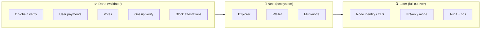

# ML-DSA Migration — Project Overview

**Purpose of this document:** A single page to present the project — goal, progress, roadmap, and what is still missing.  
**Main goal:** Replace the blockchain’s signature algorithm from **Ed25519** to **ML-DSA-44** (post-quantum, NIST standard).  
**Updated:** July 2026

---

## The goal in one sentence

Build a **quantum-resistant blockchain** on infrastructure we control by migrating every place the validator signs or verifies data from **Ed25519** to **ML-DSA-44**.

This is a **self-hosted fork** — it does **not** connect to public Solana mainnet.

---

## Why this is not a simple swap

| | Ed25519 (today) | ML-DSA-44 (target) |
|---|-----------------|---------------------|
| **Security** | Fast, widely used | Resistant to future quantum attacks |
| **Key size** | 32 bytes | ~1,300 bytes |
| **Signature size** | 64 bytes | ~2,400 bytes |

Because signatures are ~40× larger, we had to change how addresses and network packets work on **our** chain. That is why this is a fork, not a patch to live Solana.

---

## Five places signatures are used

Every blockchain node signs or checks five different things. **All five have been upgraded at demo level.**

```
┌─────────────────────────────────────────────────────────────┐
│  1. On-chain verify     Apps can check a PQ signature       │  ✅ Done
│  2. User payments       Wallets send money with PQ sigs     │  ✅ Done
│  3. Validator votes     Network agrees on blocks            │  ✅ Done
│  4. Node messaging      Validators talk to each other       │  ✅ Core done
│  5. Block broadcast     Leaders prove blocks they publish   │  ✅ Done
└─────────────────────────────────────────────────────────────┘
```

**Today:** Ed25519 still runs by default. PQ is **optional** (turned on per feature) so the chain never stops working during migration.

---

## Progress summary

| Stage | What it means | Status |
|-------|---------------|--------|
| **Prove PQ works** | Core validator accepts PQ signatures end-to-end | ✅ **~90%** — live demos pass |
| **Pilot network** | Wallet, explorer, multi-node cluster | 🔄 **~40%** — not started in repo |
| **PQ-only production** | No Ed25519 dependency anywhere | ⏳ **~25%** — Phase 4 not started |

---

## Roadmap — what has been done

| Phase | Delivered | Verified how |
|-------|-----------|--------------|
| **0** | Chain can verify PQ signatures on demand | Live demo + automated tests |
| **1** | Users can send SOL with PQ-signed transactions | Live transfer demo |
| **2** | Validator votes and finalizes blocks with PQ | Live vote demo |
| **2b** | Nodes can send and verify PQ-signed gossip messages | Two-node automated test |
| **3** | Blocks carry PQ attestations when enabled | Live shred demo |

**Supporting work already in the codebase:**

- PQ key types and transaction format (`sdk/src/ml_dsa_*.rs`)
- On-chain verify program (`sdk/program/src/ml_dsa_program.rs`)
- CLI key generation (`solana-keygen --scheme mldsa44`)
- Transaction fee / compute pricing for PQ verify
- NIST conformance tests + cross-check vs JavaScript reference
- Demo scripts for every phase (`programs/ml-dsa-tests/demo*.sh`)

---

## Roadmap — what still needs to be done

### Near term — make it usable (not in validator repo yet)

| Item | Why it matters | Status |
|------|----------------|--------|
| **Block explorer** | Show PQ txs in a browser for team / stakeholders | ❌ Not in repo |
| **Browser / mobile wallet** | Real users cannot pay with PQ today | ❌ Not in repo |
| **Multi-node cluster** | Only proven on single machine so far | ❌ Not in repo |
| **CI test cleanup** | ~13 unit tests still fail (packet-size change) | ❌ Open |

### Medium term — complete the signature migration (Phase 4)

These are the **main gaps still inside the validator** for a full Ed25519 → ML-DSA cutover:

| Item | What still uses Ed25519 today | Status |
|------|------------------------------|--------|
| **Node network identity** | QUIC/TLS certificates require Ed25519 keys | ❌ Not started |
| **Node gossip identity** | A node does not sign its own identity with PQ yet | ❌ Blocked by identity |
| **Ping / Pong / Prune** | Low-level gossip control messages | ❌ Still Ed25519 only |
| **Off-chain message signing** | CLI wallet messages | ❌ Not migrated |
| **PQ-only shred liveness** | Ed25519 still required for block liveness; PQ is additive | ❌ By design for now |

### Longer term — production hardening

| Item | Status |
|------|--------|
| Multi-signer PQ transactions (only single signer today) | ❌ |
| Modern transaction formats (v0 / lookup tables) | ❌ |
| PQ mnemonic key recovery (`recover --scheme mldsa44`) | ❌ Not wired |
| PQ-only network mode (turn off Ed25519 entirely) | ❌ |
| Performance tuning (PQ verify is CPU-heavy, ~2× slower) | 🔄 Partially priced |
| Security audit before public launch | ❌ |
| Operational runbooks (monitoring, key rotation) | ❌ |

### Explicitly out of scope

| Item | Reason |
|------|--------|
| Public Solana mainnet compatibility | Packet size and wire format differ by design |
| Match current mainnet throughput | PQ signatures are larger and slower |

---

## Timeline (suggested)

```
2026 Q2  ████████████████████  Phases 0–3 proven (DONE)
2026 Q3  ░░░░░░░░░░░░░░░░░░░░  Explorer + wallet + multi-node pilot
2026 Q4  ░░░░░░░░░░░░░░░░░░░░  Phase 4 design + identity / TLS work
2027 Q1  ░░░░░░░░░░░░░░░░░░░░  Hardening + security audit
```

| Period | Focus |
|--------|--------|
| **Jul – Sep 2026** | Explorer MVP, PQ wallet, 3+ validator testnet |
| **Sep – Dec 2026** | Phase 4 — PQ node identity and TLS |
| **Q1 2027** | Production hardening and external audit |

*Adjust based on team size and budget.*

---

## Functional map — done vs remaining



---

## How to see it working

Engineering can run live demos (each starts a test network, runs a real PQ flow, then stops):

| Demo | Shows |
|------|--------|
| `demo.sh` | PQ signature verified on-chain |
| `demo-transfer.sh` | PQ-signed payment confirms |
| `demo-vote.sh` | Chain finalizes on PQ votes |
| `demo-shred.sh` | Blocks carry valid PQ attestations |

Full step-by-step (script + manual CLI): [`ml-dsa-runbook.md`](./ml-dsa-runbook.md)

---

## Document index

| Document | Use when you need… |
|----------|-------------------|
| **This file** | Presentation / team overview |
| [`ml-dsa-migration-status.md`](./ml-dsa-migration-status.md) | Team status update (non-technical) |
| [`ml-dsa-migration.md`](./ml-dsa-migration.md) | Full technical strategy |
| [`ml-dsa-explorer-roadmap.md`](./ml-dsa-explorer-roadmap.md) | Explorer build plan |
| [`ml-dsa-runbook.md`](./ml-dsa-runbook.md) | How to run and test each phase |
| [`../CLAUDE.md`](../CLAUDE.md) | Build environment and engineering notes |

---

## Key takeaway for presentations

> **The signature migration is proven in the validator (Phases 0–3).**  
> **What remains:** user-facing tools (explorer, wallet), multi-node testing, then Phase 4 to remove the last Ed25519 dependencies for a PQ-only network.
